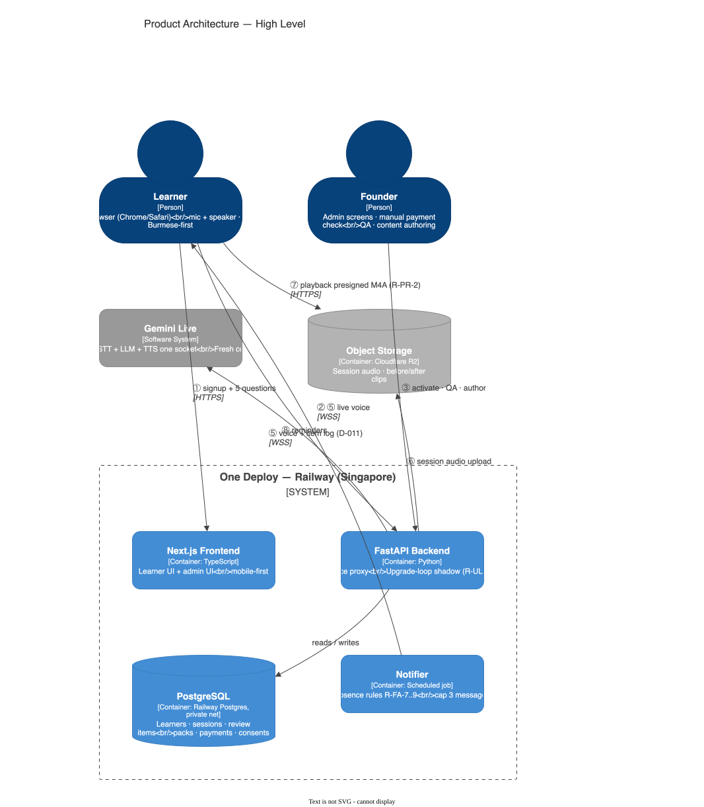
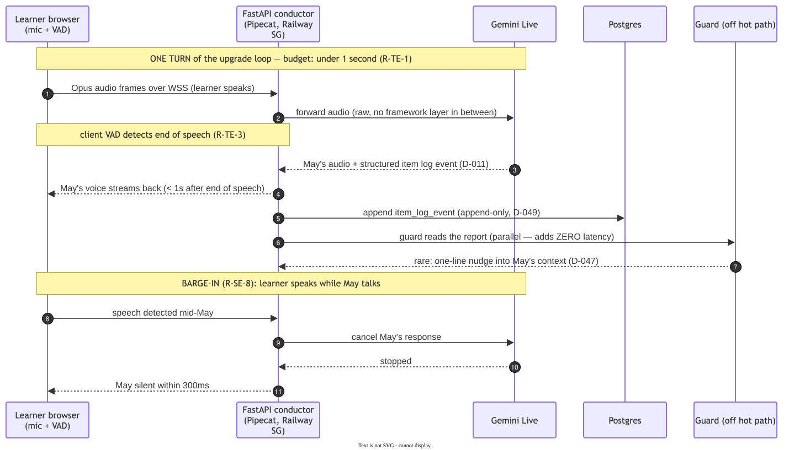
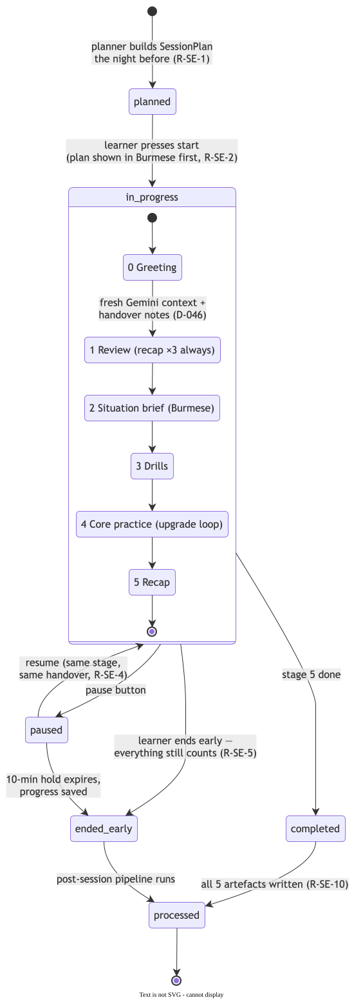
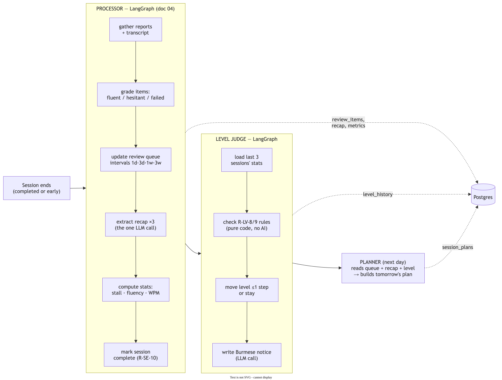
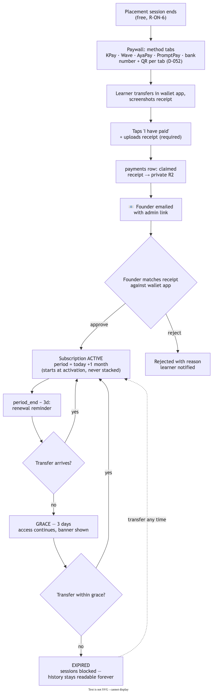

# The 2-Minute Recap — how this thing works, in plain words

> The short version of [00-system-overview.md](00-system-overview.md). Same truth, simple words. When you want detail, click through.

---

## What we're building

An app where a Burmese adult talks English with **May** — an AI tutor — 40 minutes a day, for **$25/month**. May knows their level, fixes their phrases, and makes them say the better version out loud. The proof: their own voice, week 1 vs week 4.

## The one picture that matters

Two people (learner + you), three of our boxes (**website · Python backend · database**, all on Railway Singapore), and a few helpers outside (Gemini = May's voice, R2 = the recordings shelf, Telegram = reminders).

## How a lesson works

**1. Live — one turn of talking** (the heart): the learner speaks → Gemini answers as May in **under 1 second** → if the learner interrupts, May shuts up in 0.3s:

**2. The lesson has 6 parts** (hello → review → setup → drills → real practice → wrap-up), each a fresh phone-call to Gemini with a "handover note" so May never forgets. Pause, resume, quit early — everything still counts:

**3. After the lesson**, our code grades every phrase (smooth / hesitant / failed), schedules them to come back (1 day → 3 days → 1 week → 3 weeks), writes the "3 things that held you back" — which return next session, **always** — and builds tomorrow's plan:

## Who's the boss?

**Our code. Always.** May only talks — our code picks the lesson, watches her reports every turn, flags rule-breaks to your Sunday list, and nudges her mid-lesson if needed. AI is the voice, never the driver.

## The money

Learner pays by **KPay/Wave/AyaPay/PromptPay** to your personal wallet → uploads the receipt screenshot → you get an email → you tap Approve → month starts. Miss a renewal? 3 gentle days of grace, then sessions pause (their history stays forever):

**Math per learner:** ~$6 AI cost vs $25 in. Healthy.

## What we deliberately DON'T do

No app stores (web only) · no card checkout (Myanmar wallets) · no free-roaming AI (scripted show, brilliant performer) · no Redis/queues/microservices (50 users don't need them) · only ONE content pack at launch (interviews — the test; nurses, street food, delivery come later).

## The 4 numbers that decide everything (week-one spike)

1. Does Gemini reliably report what happened each turn? (the cost trick, D-011)
2. May shuts up in **≤ 0.3s** when interrupted?
3. May answers in **< 1s**?
4. Does May's **Burmese** sound right?

If these pass, the design holds. If one fails, the decisions log says exactly what we fall back to.

---

*Everything here is decided and written down properly — 9 design docs, 53 logged decisions. Start at the [full overview](00-system-overview.md) when you need the real detail.*
