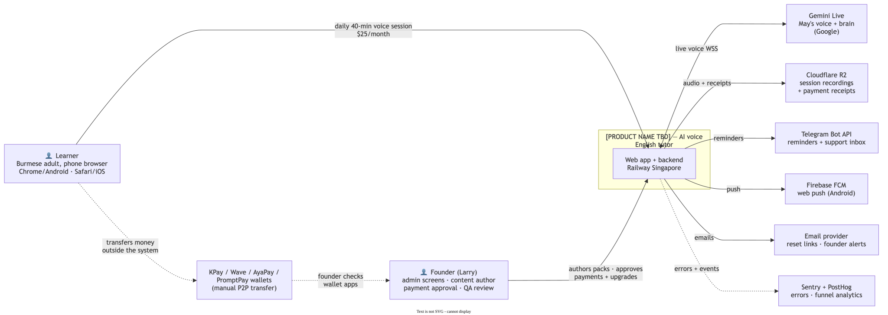
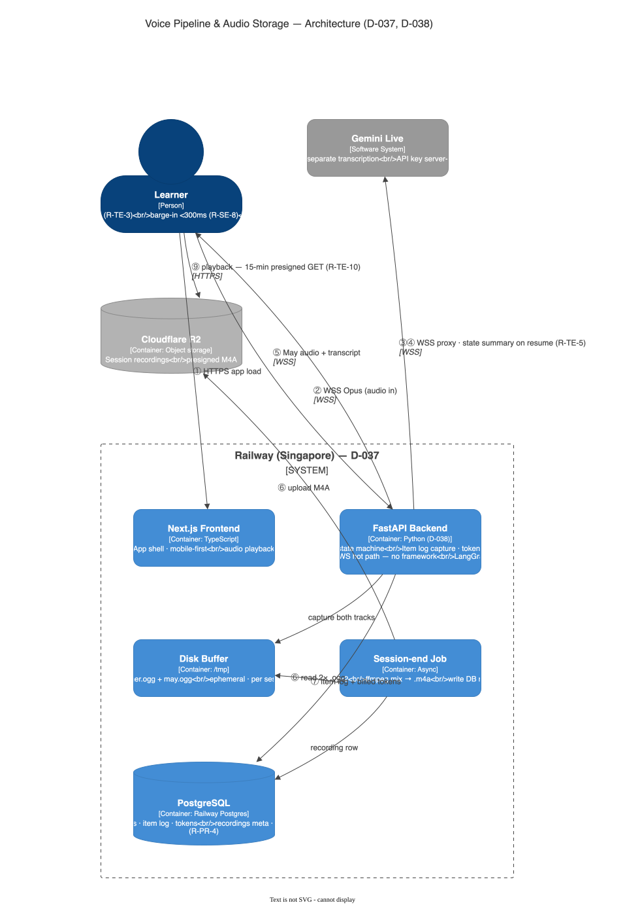
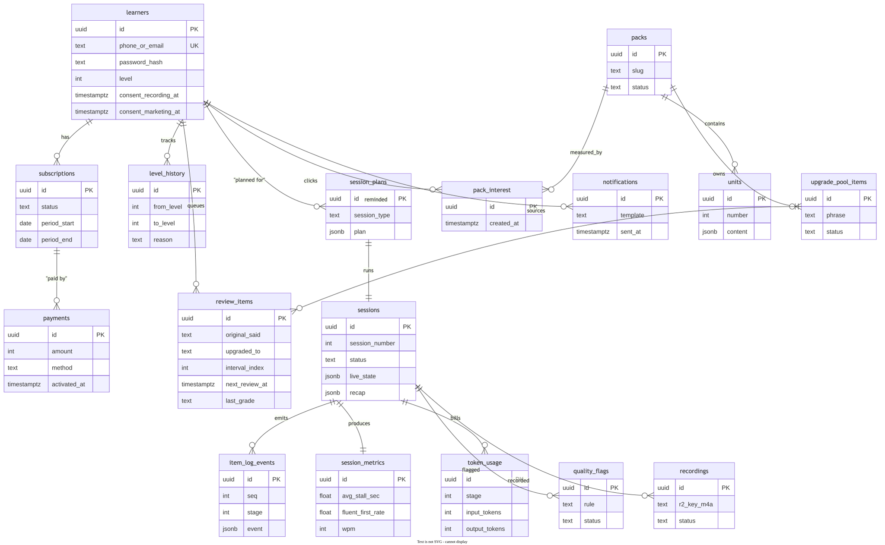

# System Overview — the whole design in one place

**Status:** Living document (reflects the approved designs 01–09 as of 2026-09-11)
**Author:** Larry (Thar Linn Htet)
**How to read:** top to bottom, zooming in — world → boxes → time → states → data. Each section has one diagram and links to the deep-dive doc. This page is the *entry point*; nothing here overrides the numbered docs — every claim cites its source (`doc NN`, `R-xx-n`, `D-xxx`).

---

## 0. What the product is (30 seconds)

A web app where a Burmese adult opens a page, presses one button, and is in a live 40-minute spoken English lesson with **May** — an AI tutor who knows their level, their goal, and what they got wrong last time. $25/month, one session per day, alternating new-lesson days and review days (D-042). The tutor teaches through the **upgrade loop**: name what worked → give ONE better phrase → the learner must say it back (D-004). Proof of progress = the learner's own before/after voice recordings (R-PR-2).

**Goals:** sub-1-second voice latency (R-TE-1) · Burmese-first scaffolding that changes with level (R-LV-4) · never lose a recording (R-ON-7) · every teaching rule enforced, visibly (R-UL-1).
**Non-goals (MVP):** native mobile apps · automated payments · autonomous AI (our code is the boss, the AI is the voice — doc 04) · more than one content pack (D-043).

---

## 1. Level 1 — The system in its world (C4 Context)

Who and what touches the system, and nothing else.

*Source files: [drawio](diagrams/00-system-context.drawio) · Deep dives: [01-architecture-and-stack](01-architecture-and-stack.md)*

Two humans: the **learner** (phone browser, no install) and the **founder** (admin + content + payment approval). Five external services: **Gemini Live** (May's voice+brain, D-044), **R2** (files, D-039), **Telegram/FCM/email** (notifications, D-053), **wallet apps** (money moves *outside* the system — manual P2P per D-052), **Sentry/PostHog** (observability, D-041).

## 2. Level 2 — The containers (what runs where)

The boxes we deploy and the learner journey ①–⑧ through them.

*Source: [drawio](diagrams/product-overview-architecture.drawio) · Deep dives: [01](01-architecture-and-stack.md) (stack manifest), [02](02-voice-pipeline.md) (voice), [03](03-audio-storage.md) (audio)*

Two services on **Railway Singapore** (D-037): the **Next.js frontend** (TypeScript, learner + admin UI) and the **FastAPI backend** (Python, D-038) with **Railway Postgres** beside them. The backend holds every module: voice proxy (Pipecat, D-045), session engine, review queue, payments, notifier, admin API. Rule of the house: *LangGraph thinks, our Python conducts, Pipecat carries audio* (D-048) — and no framework ever sits in the sub-1s hot path.

## 3. Level 3 — The voice pipeline (inside the critical container)

The latency-critical machinery: browser ↔ FastAPI ↔ Gemini, plus two-track recording to R2.

*Source: [drawio](diagrams/voice-pipeline-architecture.drawio) · Deep dives: [02-voice-pipeline](02-voice-pipeline.md), [03-audio-storage](03-audio-storage.md)*

Key numbers: WebSocket + heartbeat (ping 20s, 2 misses → reconnect, D-036) · latency budget ~575–960ms end-to-end · both voices captured server-side as separate Opus tracks → R2 → M4A for old-iPhone playback (D-039) · recordings kept forever (D-040).

## 4. One turn, in time (sequence — the heart of the product)

What happens in the milliseconds of a single upgrade-loop exchange, including barge-in.

*Source: [drawio](diagrams/00-voice-turn-sequence.drawio) · Deep dives: [02](02-voice-pipeline.md) §latency, [04](04-session-engine.md) §guard*

The two promises this diagram carries: May's voice starts **< 1 second** after the learner stops (R-TE-1), and May goes silent **≤ 300ms** when interrupted (R-SE-8 — the Pipecat #3381 verification in the week-one spike, D-045). The guard reads May's per-turn report (item log, D-011) on a side path — watching costs zero latency (D-047).

## 5. A session's life (state machine)

Every state a session can be in, and the six stages inside a live one.

*Source: [drawio](diagrams/00-session-lifecycle.drawio) · Deep dive: [04-session-engine](04-session-engine.md)*

Planned the night before (R-SE-1, plan shown in Burmese before start) → six stages, each a **fresh Gemini context + handover notes** so May stays cheap *and* never forgets (D-046) → pause holds 10 minutes (R-SE-4) → ending early still counts everything (R-SE-5) → "processed" only when all five artefacts exist (R-SE-10). Time budgets are soft — May is never cut off mid-sentence.

## 6. After the session (the thinking pipeline)

How a finished session becomes review items, a recap promise, stats, and possibly a level change — and feeds tomorrow's plan. This is where **LangGraph** lives (D-048).

*Source: [drawio](diagrams/00-post-session-pipeline.drawio) · Deep dives: [04](04-session-engine.md) §processor/judge, [05](05-data-model.md)*

Items graded by **delivery** — fluent / hesitant / failed (R-RV-8; hesitant is the grade this product exists to fix). The three recap items return next session *unconditionally* — the promise machine (R-RC-2/3). Level movement is **pure code**, never AI mood (R-LV-8/9); the LLM only writes the announcement.

## 7. Money (flowchart)

From paywall to active subscription, with the manual rail made stateful.

*Source: [drawio](diagrams/00-payment-flow.drawio) · Deep dive: [08-payments](08-payments.md)*

Personal-wallet P2P (KPay/Wave/AyaPay/PromptPay QR — zero merchant integration, D-052) · receipt screenshot required with every claim · founder emailed, approves in admin · 3-day grace, periods start at activation, history stays readable after expiry forever.

## 8. The data (ER)

The 17 tables everything above reads and writes.

*Source: [drawio](diagrams/05-data-model.drawio) · Deep dive: [05-data-model](05-data-model.md)*

Three structural rules (D-049): **UUIDs everywhere** (nothing guessable in URLs, R-TE-10) · **item_log_events is append-only truth** (any processing bug is healed by replay) · ***normalize what you query, JSON what you pass around*** (plans are JSONB; review items are proper rows).

## 9. Cross-cutting concerns (the Google-style short sections)

- **Latency** — the 1s budget drives region (Singapore), transport (WebSocket), and the no-framework-in-hot-path rule. Budget table in [02](02-voice-pipeline.md).
- **Quality** — watch-and-nudge guard + weekly prompt loop + eval suite (~20 test conversations, run before any prompt ships). Flag-rate per 100 turns is the tracked metric (D-047).
- **Cost** — architecture F ≈ $6.15/learner/month realistic vs $25 revenue; every figure re-checked against real token logs (R-TE-8) in week one. Tables in the BRD.
- **Failure** — heartbeat/reconnect loses ≤10s (R-TE-6) · Gemini down → text review session, never an error (R-TE-9) · server crash loses at most one recording (accepted, D-039) · an embarrassed adult quits silently, so no "wrong", no red, step-downs instead (R-FA).
- **Privacy** — recordings owner-or-founder only via 15-min presigned URLs (R-TE-10) · two separate consents, never bundled (R-PR-4) · deletion promise stands, flow deliberately parked (D-051).
- **Observability** — Sentry (errors) + PostHog (the funnel; "session completed with session number" is the single most important event — PRD 15.1).

## 10. The doc map (where to zoom deeper)

| Doc | Owns | Key decisions |
|---|---|---|
| [01 Stack](01-architecture-and-stack.md) | the manifest, third parties, deliberate non-picks | D-037/038/041/045 |
| [02 Voice pipeline](02-voice-pipeline.md) | transport, latency, heartbeat, hosting | D-035/036/037 |
| [03 Audio storage](03-audio-storage.md) | capture, R2, playback, retention | D-039/040 |
| [04 Session engine](04-session-engine.md) | planner/conductor/guard/processor/judge | D-046/047/048 |
| [05 Data model](05-data-model.md) | 17 tables, conventions, indexes | D-049 |
| [06 Content format](06-content-format.md) | YAML units, bands, pool, sync | D-050 |
| [07 Auth + consent](07-auth-and-consent.md) | signup, JWT, consents, placement artefacts | D-051 |
| [08 Payments](08-payments.md) | wallets, receipts, grace, admin | D-026/042/052 |
| [09 Notifications](09-notifications.md) | Telegram/push/email, the 4 messages | D-053 |
| [Requirements](../requirements/) | PRD (R-xx-n), BRD, vision, marketing, [decisions log](../requirements/05-decisions-log.md) (D-001…D-053) | — |

**Rule for keeping this page honest:** when a numbered doc changes, whoever changes it updates the matching section + diagram here in the same PR. This page summarises; it never decides.
